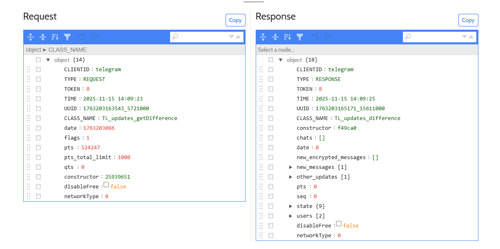

<div align="center">
   

  # Telegram Request Sniffer

  A network debugging tool for monitoring and analyzing Telegram API (TLRPC) traffic during development and research. This tool helps developers understand how Telegram features work like messaging, video calls, updates, channels, comments, file transfers, and more—by intercepting and visualizing API calls in real-time.

  [](https://opensource.org/licenses/MIT)
  [](https://golang.org/)
</div>



## What is This Project?

### About Telegram's Open Source Android App  

[Telegram](https://telegram.org) provides an official open-source Android application under the GPLv3 license.
- **Official Repository:** https://github.com/DrKLO/Telegram
- **License:** GNU General Public License v3.0

This allows developers and researchers to:
- Study how Telegram works internally
- Build custom versions for research
- Understand the Telegram Layer Protocol (TLRPC)
- Debug and improve Telegram clients

### Why I Created This Tool

As a developer working with Telegram's source code, I needed a way to:

1. **Understand TLRPC:** Telegram uses a custom protocol (TLRPC) for client-server communication. This tool visualizes these API calls in real-time, making it easier to understand how the protocol works.

2. **Learn Feature Implementation:** By observing the network traffic, you can understand how Telegram implements various features:
   - **Messaging:** How text, media, and formatted messages are sent and received
   - **Video/Voice Calls:** How peer-to-peer connections are established and managed
   - **Updates & Notifications:** How real-time updates are pushed from the server
   - **Channels & Groups:** How broadcast channels and group chats operate
   - **Comments & Reactions:** How discussions and emoji reactions work
   - **File Transfers:** How photos, videos, and documents are uploaded/downloaded
   - **Stories:** How temporary stories are created and distributed
   - **Secret Chats:** How end-to-end encrypted conversations are initiated

3. **Debug Custom Features:** When modifying the Telegram Android app, it's essential to see what data is being sent to and received from Telegram's servers.

4. **Development Transparency:** Having a clear view of API requests and responses helps identify bugs, understand data structures, and optimize performance.

### What This Tool Does

This is **NOT a hacking tool**. It is a **development and research tool** similar to browser developer tools or network analyzers like Wireshark, but specifically designed for Telegram's TLRPC protocol.

**How it works:**
1. You integrate a small Java class into *your own modified version* of the Telegram Android source code
2. This class intercepts TLRPC objects (requests, responses, updates) within the app
3. The intercepted data is sent via WebSocket to a local server
4. A web dashboard displays the traffic in a human-readable JSON format

**This tool only works with:**
- Modified versions of Telegram that you compile yourself
- Your own Telegram account and API credentials
- Local or controlled network environments

---

## Features

- **Real-time Monitoring:** View Telegram API calls as they happen
- **Request/Response Correlation:** Match requests with their responses using tokens
- **Interactive JSON Viewer:** Explore complex TLRPC objects with collapsible JSON trees
- **Filtering:** Filter by message type (REQUEST/RESPONSE/ERROR/SERVER)
- **Export/Import:** Save sessions for later analysis
- **WebSocket-based:** Lightweight and fast communication
- **Docker Support:** Easy deployment with Docker and Docker Compose

---

## Legal Disclaimer

**This tool is intended ONLY for authorized security research, development, and educational purposes.**

- Use for debugging your own Telegram client modifications
- Use for security research in controlled environments
- Use for educational purposes with proper authorization
- **Never use to intercept others' communications without consent**
- **Never use in violation of laws or Telegram's ToS**

By using this software, you accept full responsibility for ensuring your use complies with all applicable laws and regulations. See [SECURITY.md](SECURITY.md) for detailed legal and ethical guidelines.

---


## Architecture

```
┌────────────────────────────────────┐
│ Modified Telegram Android          │
│ (with TelegramRequestSniffer.java) │
└──────────────┬─────────────────────┘
               │ WebSocket
               │ (JSON over WS)
               ▼
┌─────────────────────────────┐
│   Go WebSocket Server       │
│   (Gorilla WebSocket)       │
└──────────────┬──────────────┘
               │ Broadcast
               │
               ▼
┌─────────────────────────────┐
│   Web Dashboard (Vue.js)    │
│   Real-time JSON Viewer     │
└─────────────────────────────┘
```

See [docs/ARCHITECTURE.md](docs/ARCHITECTURE.md) for detailed technical documentation.

---

## Prerequisites

- **Go** 1.21 or higher ([Download](https://golang.org/))
- **Telegram Android Source Code** ([GitHub](https://github.com/DrKLO/Telegram))
- **Android Studio** for building the modified Telegram app
- **Java WebSocket Library:** Add to your Telegram project's `build.gradle`:
  ```gradle
  implementation 'org.java-websocket:Java-WebSocket:1.5.1'
  ```

---

## Installation

### 1. Clone the Repository

```bash
git clone https://github.com/moradi-morteza/telegram-request-sniffer.git
cd telegram-request-sniffer
```

### 2. Install Dependencies

```bash
go mod download
go mod tidy
```

Or simply:

```bash
make deps
```

### 3. Configure Environment

Copy the example environment file:

```bash
cp .env.example .env
```

Edit `.env` to configure your settings:

```env
PORT=3000
NODE_ENV=development
CORS_ORIGIN=*
```

### 4. Build and Start the Server

**Option A: Using Make (Recommended)**
```bash
make run
```

**Option B: Using Go directly**
```bash
go run cmd/server/main.go
```

**Option C: Build binary first**
```bash
go build -o telegram-sniffer cmd/server/main.go
./telegram-sniffer
```

**Option D: Windows batch file**
```cmd
run.bat
```

**Option E: Linux/Mac shell script**
```bash
chmod +x run.sh
./run.sh
```

The server will start on `http://localhost:3000`

---

## Android Integration

### Step 1: Add WebSocket Dependency

In your Telegram project's `build.gradle`, add:

```gradle
implementation 'org.java-websocket:Java-WebSocket:1.5.1'
```

### Step 2: Copy TelegramRequestSniffer.java

Copy `android/TelegramRequestSniffer.java` to your Telegram project:

```
YourTelegramProject/
└── TMessagesProj/
    └── src/
        └── main/
            └── java/
                └── org/
                    └── telegram/
                        └── TelegramRequestSniffer.java
```

### Step 3: Configure Server URL

Edit `TelegramRequestSniffer.java` and update the server URL:

```java
// For Android Emulator connecting to host machine:
private static String serverUrl = "ws://10.0.2.2:3000";

// For real device on same WiFi (replace with your computer's IP):
private static String serverUrl = "ws://192.168.1.100:3000";

// For production server with SSL:
private static String serverUrl = "wss://your-server.com";

// Set a unique client identifier:
private static String clientId = "my-test-device";
```

### Step 4: Initialize the Sniffer

In `ApplicationLoader.java`, add initialization:

```java
public static void postInitApplication() {
    // ... existing code ...

    // Initialize TelegramRequestSniffer
    TelegramRequestSniffer.init(applicationContext);

    // ... rest of code ...
}
```

And cleanup:

```java
@Override
public void onTerminate() {
    // Disconnect WebSocket
    TelegramRequestSniffer.disconnectWebSocket();

    super.onTerminate();
}
```

### Step 5: Log TLRPC Traffic

#### A. Log Incoming Updates (Server Push)

In `MessagesController.java`, find the `processUpdates()` method:

```java
public void processUpdates(final TLRPC.Updates updates, boolean fromQueue) {
    // Log incoming updates from server
    TelegramRequestSniffer.logTLRPCObject(updates, "Server", 0);

    // ... existing Telegram code ...
}
```

#### B. Log Requests and Responses

In `ConnectionsManager.java`, find the `sendRequest()` method:

```java
public int sendRequest(final TLObject object, ...) {
    final int requestToken = lastRequestToken.getAndIncrement();

    // Log the outgoing request
    TelegramRequestSniffer.logTLRPCObject(object, "Request", requestToken);

    // ... existing code ...

    // Inside the response handler:
    native_sendRequest(currentAccount, buffer.address, (response, errorCode, errorText, ...) -> {
        // ... parse response ...

        // Log the response
        TelegramRequestSniffer.logTLRPCObject(finalResponse, "Response", requestToken);

        // Log errors if any
        if (error != null) {
            TelegramRequestSniffer.logTLRPCObject(error, "Error", requestToken);
        }

        // ... rest of handler ...
    });
}
```

### Step 6: Build and Run

1. Build your modified Telegram app in Android Studio
2. Install it on your device/emulator
3. Ensure the device can reach your server (same network or use `10.0.2.2` for emulator)
4. Open the web dashboard at `http://localhost:3000`
5. Start using Telegram - you'll see API calls appear in real-time!

---

## Usage

### Web Dashboard

Once the server is running, open your browser to `http://localhost:3000`

**Features:**
- **Client ID Filter:** Enter the client ID from your Android app to see only that device's traffic
- **Type Filter:** Filter by REQUEST, RESPONSE, ERROR, or SERVER messages
- **Search:** Search through captured messages
- **Hold:** Pause capturing new messages
- **Export:** Save current session to JSON file
- **Import:** Load previously exported session
- **Clear:** Clear current messages

**Viewing Details:**
- Click "Show Json" on any message to see the full request and its correlated response
- Copy button allows copying JSON to clipboard
- Delete individual messages as needed

---

## Docker Deployment

### Using Docker Compose (Recommended)

```bash
docker-compose up -d
```

This will start the server on port 3000.

### Using Docker Directly

```bash
# Build the image
docker build -t telegram-sniffer .

# Run the container
docker run -d -p 3000:3000 --name telegram-sniffer telegram-sniffer
```

### Environment Variables in Docker

```bash
docker run -d \
  -p 3000:3000 \
  -e PORT=3000 \
  -e NODE_ENV=production \
  -e CORS_ORIGIN=* \
  --name telegram-sniffer \
  telegram-sniffer
```

---

## Configuration

### Environment Variables

| Variable      | Default       | Description          |
|---------------|---------------|----------------------|
| `PORT`        | `3000`        | Server port          |
| `NODE_ENV`    | `development` | Environment mode     |
| `CORS_ORIGIN` | `*`           | CORS allowed origins |
| `WS_HOST`     | `localhost`   | WebSocket host       |
| `LOG_LEVEL`   | `info`        | Logging level        |

### Client Configuration

Update `public/index.js` if you need to change the WebSocket URL for the web client:

```javascript
var urlLocal = "ws://localhost:3000"
```

---

## Troubleshooting

### Android App Can't Connect

**For Emulator:**
- Use `ws://10.0.2.2:3000` (this is the special IP for host machine)
- Ensure server is running on your host machine

**For Real Device:**
- Use your computer's local IP: `ws://192.168.X.X:3000`
- Ensure both device and computer are on the same WiFi network
- Check firewall settings - port 3000 must be accessible

### No Messages Appearing

1. Check that TelegramRequestSniffer.init() is called in ApplicationLoader
2. Verify WebSocket connection in Android logs: `adb logcat | grep TelegramRequestSniffer`
3. Check that you've added logging calls to MessagesController and ConnectionsManager
4. Ensure client ID in dashboard matches the one in TelegramRequestSniffer.java

### Server Won't Start

- **Port already in use:** Change `PORT` in `.env` file
- **Dependencies missing:** Run `npm install`
- **Permission denied:** Use port > 1024 or run with appropriate permissions

---

## Development

### Project Structure

```
telegram-request-sniffer/
├── cmd/
│   └── server/
│       └── main.go                    # Application entry point
├── internal/
│   ├── config/
│   │   └── config.go                  # Configuration management
│   ├── handlers/
│   │   ├── http.go                    # HTTP route handlers
│   │   └── websocket.go               # WebSocket handlers & hub
│   ├── models/
│   │   └── message.go                 # Data models
│   └── server/
│       └── server.go                  # Server initialization
├── android/
│   └── TelegramRequestSniffer.java    # Android integration code
├── public/
│   ├── index.html                     # Main dashboard
│   ├── index.js                       # Vue.js application
│   ├── client.html                    # Test client
│   └── sample/                        # Sample exports (gitignored)
├── docs/
│   └── ARCHITECTURE.md                # Technical documentation
├── go.mod                             # Go module file
├── go.sum                             # Go dependencies
├── Makefile                           # Build automation
├── Dockerfile                         # Multi-stage Go Docker build
├── docker-compose.yml                 # Docker Compose config
├── .env.example                       # Example configuration
├── run.bat                            # Windows run script
├── run.sh                             # Linux/Mac run script
└── README.md
```

### Running in Development

```bash
make dev
```

Or:

```bash
go run cmd/server/main.go
```

### Code Style

- Follow existing code conventions
- Use meaningful variable names
- Add comments for complex logic
- Test changes before submitting PRs

---

## Contributing

Contributions are welcome! Please see [CONTRIBUTING.md](CONTRIBUTING.md) for guidelines.

1. Fork the repository
2. Create a feature branch (`git checkout -b feature/amazing-feature`)
3. Commit your changes (`git commit -m 'Add amazing feature'`)
4. Push to the branch (`git push origin feature/amazing-feature`)
5. Open a Pull Request

---

## License

This project is licensed under the MIT License - see the [LICENSE](LICENSE) file for details.

**Note:** Telegram Android source code is licensed under GPLv3. Ensure you comply with Telegram's license when modifying and distributing their code.

---

## Acknowledgments

- [Telegram](https://telegram.org) for open-sourcing their Android client
- The open-source community for various libraries used in this project
- All contributors who help improve this tool

---

## Support

- [Documentation](docs/ARCHITECTURE.md)
- [Report Issues](https://github.com/moradi-morteza/telegram-request-sniffer/issues)
- [Discussions](https://github.com/moradi-morteza/telegram-request-sniffer/discussions)

---

**Made with ❤️ for the Telegram developer community**
